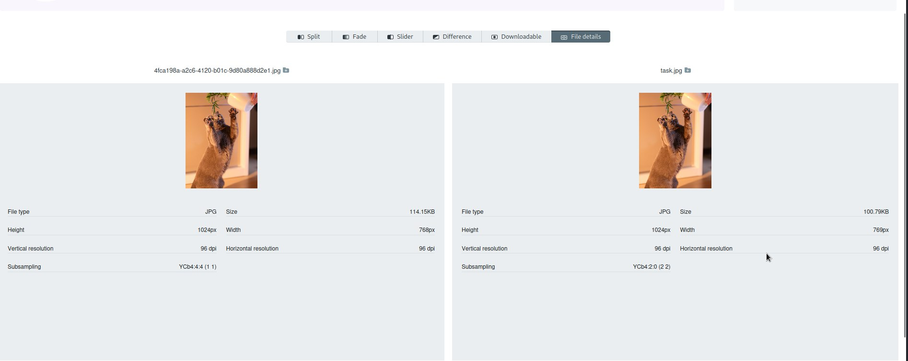

# KSB-CTF23 - stego - concat


# Introduction

[Файл](files/task.jpg)


# Solve

Как полагается, по обычаю, смотрим картинки в **stegsolve** и перебираем режимы.

Ничего интересного.

Дальше, я полез в интернете смотреть точно такую же картинку, чтобы сравнить модифицированную(задание) с оригинальной(в интернете).
В режиме **Image Combine** ничего не нашёл...

Хмм, а если сравнить точно такие-же картинки по размеру?



Как видим, из размеры отличаются на 14кБ. Быть может в нашей картинке есть файлы?

```
└─$ binwalk task.jpg 

DECIMAL       HEXADECIMAL     DESCRIPTION
--------------------------------------------------------------------------------
2642          0xA52           Copyright string: "Copyright (c) 2003, Canon Inc.  All rights reserved."
103050        0x1928A         bzip2 compressed data, block size = 900k

```

А попробуем-ка распаковать всё содержимое:


```
└─$ binwalk -e task.jpg

DECIMAL       HEXADECIMAL     DESCRIPTION
--------------------------------------------------------------------------------
2642          0xA52           Copyright string: "Copyright (c) 2003, Canon Inc.  All rights reserved."
103050        0x1928A         bzip2 compressed data, block size = 900k

```

И смотрим, что получилось:

```
┌──(anix㉿anix)-[~/…/writeups/KSB-CTF23/stego/files]
└─$ ls
byte.txt  meta.jpg  shadow.png  task.jpg  _task.jpg.extracted
                                                                                                                                                                                                                                            
┌──(anix㉿anix)-[~/…/writeups/KSB-CTF23/stego/files]
└─$ cd _task.jpg.extracted 
                                                                                                                                                                                                                                            
┌──(anix㉿anix)-[~/…/KSB-CTF23/stego/files/_task.jpg.extracted]
└─$ ls
1928A
                                                                                                                                                                                                                                            
┌──(anix㉿anix)-[~/…/KSB-CTF23/stego/files/_task.jpg.extracted]
└─$ cat 1928A       
flag.txt000644 001750 001750 00000000046 14460664202 011626 0ustar00n87n87000000 000000 KSB{8a5bddc82befb71d8ef34cc903d3d077}
```

Можно было извлечь flag.txt не криво, но в то время, я не искал эллегантности)

Получаем флаг : `KSB{8a5bddc82befb71d8ef34cc903d3d077}` 


# Spoiler

Распаковываем файл с флагом из картинки