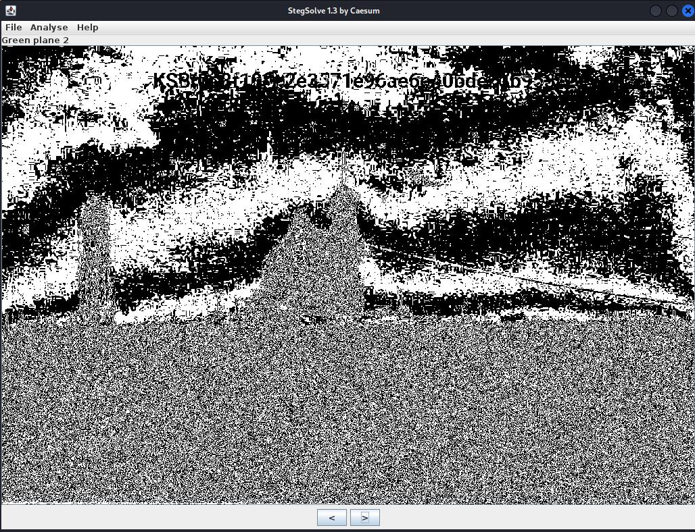

# KSB-CTF23 - stego - shadow

# Introduction

[Файл](files/shadow.png)

# Solve

Как полагается, по обычаю, смотрим картинки в **stegsolve** и перебираем режимы:

Получаем флаг : `В разных режимах смотрим и собираем флаг. С 3-его раза получилось)` 

# Spoiler

Перебираем режимы в **stegsolve** и собираем флаг