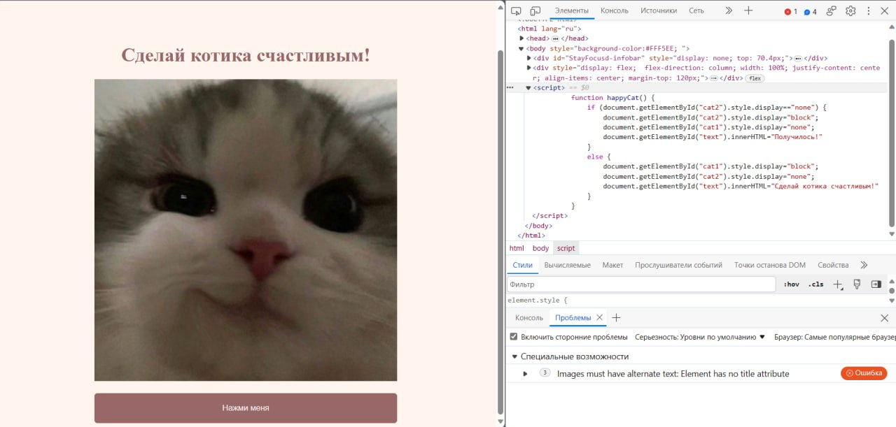

# KSB-CTF23 - web - Cat

# Introduction

# Solve

Открываем сайт и видим следующее:

Есть только кнопка **Сделать кота счастливым**. При нажатии на неё, картинка меняется. 
В HTML-коде при нажатии на кнопку вызывается JS, в котором функция меняет картинку. Смена картинки происходит на стороне клиента.
Тогда смотрим, какие данные мы передаём сайту, ибо из-за обработки данных происходят проблемы. Я сразу пошёл смотреть Cookie, ибо в них обычно что-то простое может и лежать, но если подходить строго к решению, то можно и через burp посмотреть запросы и увидеть, что вообще передаётся

В Cookie мы находим flag с значением S1NCe2VhOTdjNjYzZTVhOGViMjRmNGExZjUzYmUxNTBhMWQ5fQo= 
Либо уже по виду догадываемся, что это Base64, либо используем нашего любимого повара с магией (https://gchq.github.io/CyberChef/#recipe=Magic(3,false,false,'')&input=UzFOQ2UyVmhPVGRqTmpZelpUVmhPR1ZpTWpSbU5HRXhaalV6WW1VeE5UQmhNV1E1ZlFvPQ)

Получаем флаг : `KSB{ea97c663e5a8eb24f4a1f53be150a1d9}` 

# Spoiler

Смотрим Cookie и декодируем куку **flag** с Base64