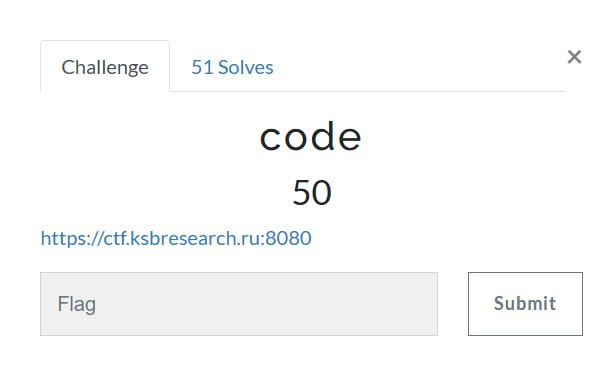
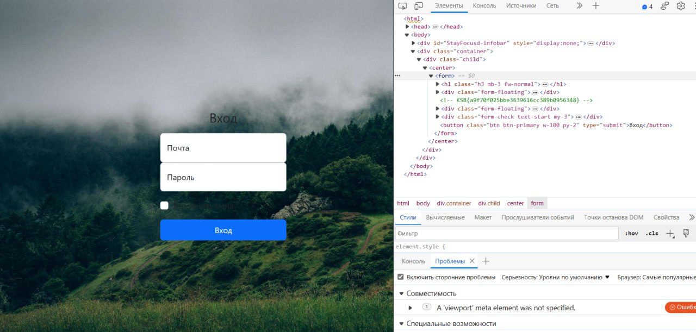

# KSB-CTF23 - web - Code

# Introduction

# Solve

Задание названо Code, быть может всё дело в коде. Открываем страницу. Смотрим её HTML-код и находим следующее:

Получаем флаг : `KSB{a9f70f025bbe3639616cc389b0956348}` 

# Spoiler

Смотрим HTML-код страницы