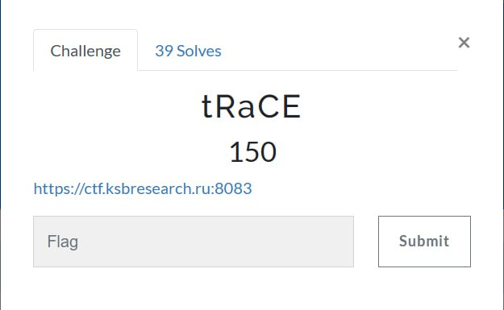
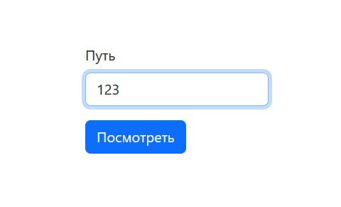
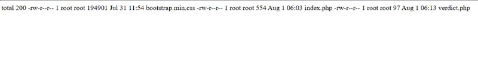
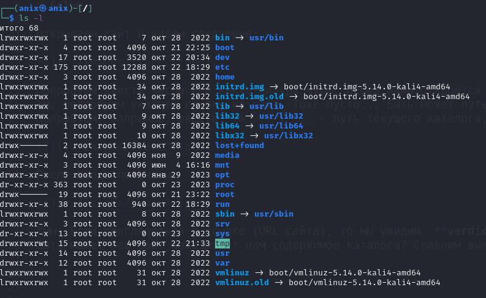
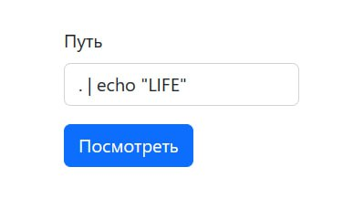
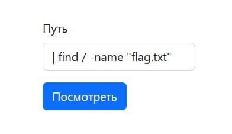
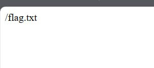
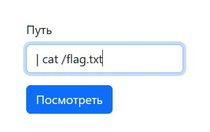
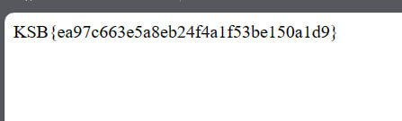

# KSB-CTF23 - web - tRaCE

# Introduction

# Solve

Открываем сайт и видим следующее:

Попробуем ввести числа или какую-нибудь чушь. Перед нами откроется пустая страница... 
Хм, попробуем указать ссылку на сайт. Тоже пусто... Быть может путь до файла или директории?
Попробуем, например, ввести  -> `.`	( `.` - путь текущего каталога, в котором у вас действует процесс)

После ввода получаем:

Хмм. Если приглядеться к ссылке (URL сайта), то мы увидим  **verdict.php**, и его же мы видим на странице, с какой-то информацией.
Быть может наш сайт показывает нам содержимое каталога? Сравним вывод сайта с командой `ls -l` на линуксе

А формат-то данных похож! Быть может сайт выполняет команду `ls -l {Ваш ввод}` ?

Чтобы в этом убедиться, то можно, например, ввести путь `/`. Информация должна быть практически такой же, как и на изображении выше.

Теперь вопрос, как этим воспользоваться?

Вспомним, что команды можно выполнять последовательно и писать не в две строки, а в одну. Например: `ls; pwd` Можно в команду на сервере внедрить свою команду! Допустим, вы бы хотели вывести результат команд `ls` и `echo` Вы бы сделали это так `ls; echo LIFE`

Вспомним, что сайт выполняет следующую команду `ls -l {Ваш ввод}`

Сравним логику сайта и то, что мы бы сделали:

`ls -l {Ваш ввод}`
`ls; echo LIFE`

А может быть нам ввести `; echo LIFE` ?

Дальше, вместо `;` я буду использовать `|`, чтобы не выводился лишний `ls` на странице.

Получаем сию картину:

Как видим, наш результат изменился! Вывелся не `ls`, а `echo`. Остаётся дело за малым! Придумать, как найти флаг и ввести команды!
Обычно все флаги называются **flag.txt**. Используем команду `find` для поиска файла и получаем следующий ввод: `| find / -name "flag.txt"`

Результат:

Как видим, **flag.txt** находится по следующему пути: `/flag.txt`. Давайте с помощью `cat` откроем его! `| cat /flag.txt`

Результат:

Yep! 

Получаем флаг : `На последней картинке` 

# Spoiler

Используем RCE: находим **flag.txt** и открываем его