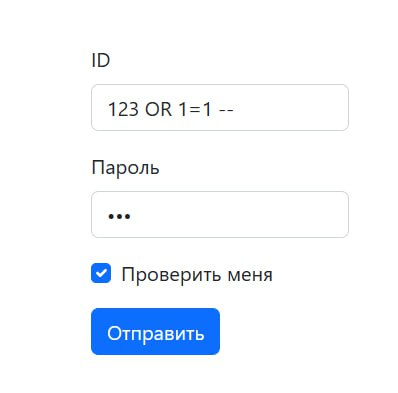
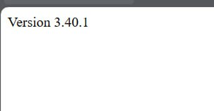

# KSB-CTF23 - web - vaccine

# Introduction

# Solve

Открываем сайт и видим следующее:

Попробуем ввести числа или какую-нибудь чушь. 
Ничего... Надо сказать, что у ИБшников свой скрытый язык... Дело в том, что при авторизации обычно затрагиваются базы данных, в которых хранятся логины, пароли и прочее. Для некоторых запросов (не параметризированных, хотя это ещё зависит от логики сайта) возможна уязвимость **SQLi**. Попробуем её здесь.

**ID** - персональный индентификатор, обычно служит для различия между данными. Например, у вас есть два человека, с одинаковыми ФИО, кредитами и прочим.
Чтобы их различать, можно им вручить номерки. Вот эти номерки, которые, к слову, есть в гардеробах, используются и в базах данных.

Значит можно предположить, что в поле **ID** вводится номер (т.к. номер - это число, значит предполагается ввод числа).

Попробуем нарушить логику и вместо числа введём строку. Можно просто взять число в кавычки.

Получаем:

Как видим, вылезла ошибка, а значит, мы нарушили какую-то логику на сервере. Если посмотрим на ошибку, то можно составить примерно такой запрос, который происходит на сервере:

`SELECT id, name FROM (не известно какая таблица)`

Т.е. мы влияя на параметр **id** смогли повлиять на логику работы сервера с базой данных.
Предположим, что сайт проверяет пользователя по логину и паролю. Примерно следующее:

`SELECT id, name FROM (не известно какая таблица) WHERE id = (ваш id) AND password = (ваш пароль)`

А давайте сделаем инъекцию в запрос, как мы делали в команде `ls` на [tRaCE](web/tRaCE.md).

Введём следующее: `123 OR 1=1 -- `

Сервер выполнит примерно следующее: `SELECT id, name FROM (не известно какая таблица) WHERE id = 123 OR 1=1 --  AND password = (ваш пароль)`

` -- ` - коментарий в SQL. Это значит, что в запросе часть ` AND password = (ваш пароль) ` - просто проигнорируется, а значит, выполнится следующее:

`SELECT id, name FROM (не известно какая таблица) WHERE id = 123 OR 1=1`

База данных(в дальнейшем БД) смотрит, есть ли записи с **id = 123** ИЛИ **1=1**. 
Если **id** в БД вы не всегда найдёте равным 123, то 1=1 выполняется всегда, а значит любая запись из БД подойдёт под это условие.

Получаем:

Используя **UNION**, определяем количество столбцов в **SELECT** (получим 2, т.к. мы выводим id и name)

**Payload** : `123 UNION SELECT LIFE, LIFE -- `

Результат:

Т.к. мы можем объединять записи только с **одинаковым** количеством столбцов, то нам придётся учитывать 2 столбца в дальнейшем и с помощью их выводить всю информацию. Мы не знаем, из какой таблицы достаётся `id` и `name`. В каждой БД, есть таблица, которая хранит список всех таблиц. В большинстве случаев, это information_schema, но в нашем таске не она (С помощью UNION запросов мы в этом убеждаемся), зато при таком запросе, у нас выводится версия, что значит, это SQLite.

**Payload** : `123 UNION SELECT 'Version', sqlite_version(); -- `

Прогресс:

Смотрим в интернете, что за хранение списка всех таблиц отвечает таблица **sqlite_master**. Обратимся к ней и выведем список всех таблиц в БД.

**Payload** : `1 UNION SELECT 'Table name -> ', name FROM sqlite_master WHERE type='table' -- `

Находим **users**. Смотрим, какие столбцы есть в этой таблице:

**Payload** : `1 UNION SELECT sql FROM sqlite_master WHERE name ='users' -- `

Получаем:

Значит, наша таблица **users**, в которой лежат данные, выглядит следующим образом:

id    |   name   |  password |
| --- | -------- | --------- |
| 1   |  admin   |    ??     |
| 2   |  ivan    |    ??     |

Теперь просто извлечём из неё все данные. **id** нет смысла учитывать, ибо для нас важна запись с **flag** (Смотрите выше, где была SQLi c **OR**):

**Payload** : `1 UNION SELECT name, password FROM users -- `

Excellent!

  

Получаем флаг : `На последней картинке` 

# Spoiler

Используем **SQLi** в параметре **login**. Находим столбец **password** и выводим его