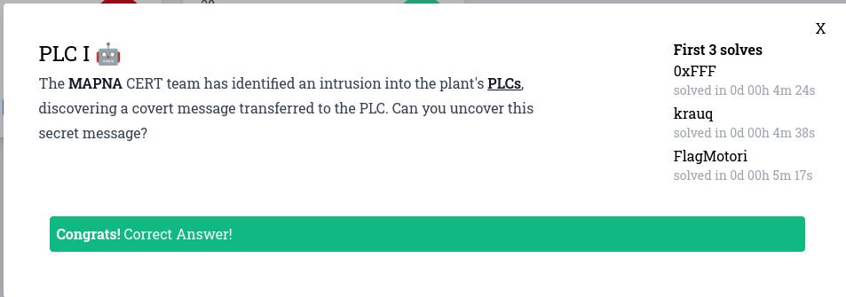

# MAPNA_CTF_2023 - forensics - PLC_I


# Introduction




# Solve

Поскольку флаг содержится в дампе трафика, давайте попробуем посмотреть все содержащиеся в нём строки:

```
└─$ strings plc.pcapng                                                                  
4-"@
(-#@
>-$@
A-%@
/-&@
I-'@
/-(@
I-)@
/-*@
I-+@
/-,@
I--@
3:Ld_4lW4
6ES7 151-8AB01-0AB0 
/-.@
E-/@
/-0@
I-1@
/-2@
I-3@
IM151-8 PN/DP CPU
/-4@
5:3__PaAD
E-5@
/-6@
1:MAPNA{y
E-7@
/-8@
4:yS__CaR
O-9@
 #      !
/-:@
E-;@
/-<@
6:d1n9!!}
E-=@
Y3td
/->@
2:0U_sHOu
(-?@
```

Заметим, что целого флага нет, а разбит он на части в формате `номер_части : часть`. Отсеим ненужное:

```
└─$ strings plc.pcapng | grep :
3:Ld_4lW4
5:3__PaAD
1:MAPNA{y
4:yS__CaR
/-:@
6:d1n9!!}
2:0U_sHOu
```

И соберём флаг: `MAPNA{y0U_sHOuLd_4lW4yS__CaR3__PaADd1n9!!}`


# Spoiler

Смотрим строки в дампе и собираем флаг по частям
