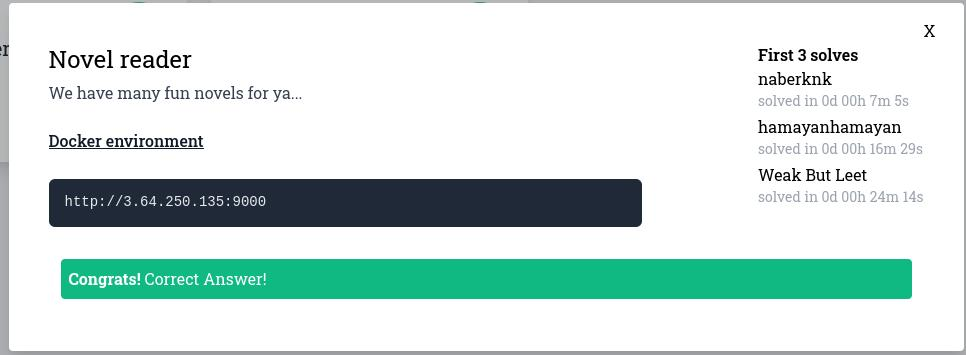
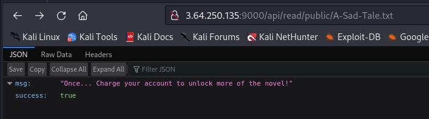
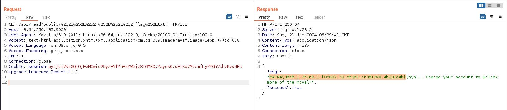

# MAPNA_CTF_2024 - web - flag_holding


# Introduction




# Solve


Посмотрим все файлы в проекте и найдём, где вообще лежат флаги:

```
./flag.txt
./Dockerfile
./stuff
./stuff/index.html
./stuff/private
./stuff/private/A-Secret-Tale.txt
./stuff/public
./stuff/public/A-Happy-Tale.txt
./stuff/public/A-Sad-Tale.txt
./stuff/main.py
./stuff/static
./stuff/static/script.js
./stuff/static/style.css

```

2 флага: **flag.txt** и **A-Secret-Tale.txt**
Начнём с первого флага, который находится в **flag.txt**. Его нам нужно как-то открыть через сайт. Идём анализировать код:

Т.к. флаг содержится именно в файле **flag.txt**, то в таком случае, нам нужно найти механизм на сайте, позволяющий загружать содержимое файлов.

**main.py**:

```
def readFile(path):
    f = open(path,'r')
    buf = f.read(0x1000)
    f.close()
    return buf
```

Как видим, есть функция **readFile**, которая открывает файл, считывает с него данные и возращает эти данные. Посмотрим, где используется эта функция:

```
indexFile = readFile('index.html')
```

И

```
@app.get('/api/read/<path:name>')
def readNovel(name):
    name = unquote(name)
    if(not name.startswith('public/')):
        return {'success': False, 'msg': 'You can only read public novels!'}, 400
    buf = readFile(name).split(' ')
    buf = ' '.join(buf[0:session['words_balance']])+'... Charge your account to unlock more of the novel!'
    return {'success': True, 'msg': buf}
```


`indexFile = readFile('index.html')` - бесполезно. Просто читает файл __index.html__ Как-то повлиять на аргумент этой функции не можем, а это нам и нужно

Поэтому рассмотрим следующее:

```
@app.get('/api/read/<path:name>') # /api/read/ВАШ_ВВОД  | name = ВАШ_ВВОД
def readNovel(name):
    name = unquote(name)                 # декодирование нашего ввода из url кодировки в ascii
    if(not name.startswith('public/')):  # если ввод не начинается с public/ - выгоняем пользователя
        return {'success': False, 'msg': 'You can only read public novels!'}, 400
    buf = readFile(name).split(' ') 
    buf = ' '.join(buf[0:session['words_balance']])+'... Charge your account to unlock more of the novel!' # Выдаём пользователю содержимое со срезом баланса
    return {'success': True, 'msg': buf}
```



Как видим, от нашего ввода зависит результат функции, а значит, нам нужно воспользоваться этим. Уязвимость эта называется Path Traversal и заключается в том, что мы обходим путь.
Воспользуемся этим. Закодируем наш ввод два раза (потому, что 1 раз декодирует сайт, а второй раз - система). 

Флаг находится в корне системы, а наши публичные заметки - `/stuff/public/` Значит нужно два раза подняться вверх по каталогу и достать флаг. 
Например: `/stuff/public/../../flag.txt`. Нужно ввести `../../flag.txt` закодированный два раза



Получаем флаг : `MAPNA{uhhh-1-7h1nk-1-f0r607-70-ch3ck-cr3d17>0-4b331d4b}` 


# Spoiler

Path Traversal и двойное url кодирование
